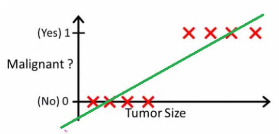
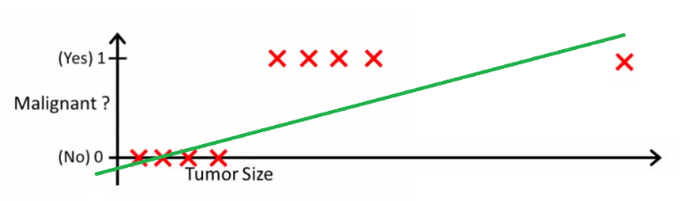

# Why we can’t do a classification problem using Regression?

With linear regression you fit a polynomial through the data - say, like on the example below, we fit a straight line through {tumor size, tumor type} sample set:

Above, malignant tumors get 1, and non-malignant ones get 0, and the green line is our hypothesis $h(x)$. To make predictions, we may say that for any given tumor size x, if $h(x)$ gets bigger than 0.5, we predict malignant tumors. Otherwise, we predict benignly.

It looks like this way, we could correctly predict every single training set sample, but now let's change the task a bit.

Now our $h(x)>0.5$→malignant doesn't work anymore. To keep making correct predictions, we need to change it to $h(x)>0.2$ or something - but that not how the algorithm should work.

**We cannot change the hypothesis each time a new sample arrives**. Instead, we should learn it off the training set data, and then (using the hypothesis we've learned) make correct predictions for the data we haven't seen before.

> **Linear regression is unbounded**

> Futher reading: [[linear-regression]], [[logistic-regression]]