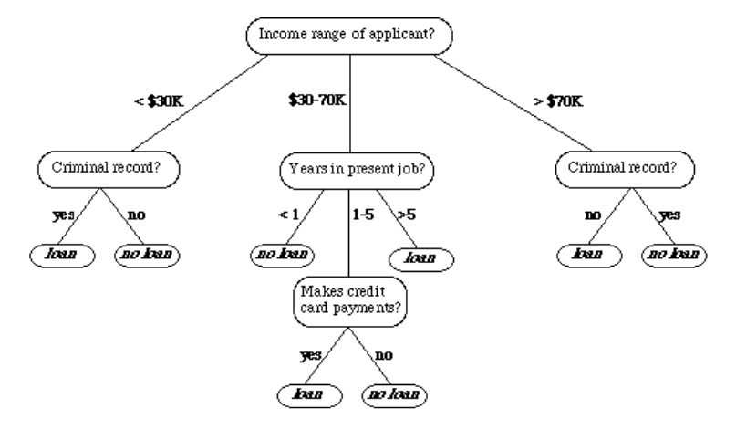

## What is decision tree?

> A decision tree is a tree-shaped model guiding us in **which order to check the features of an object**, to **output its discrete or continuous label**.

> a type of supervised learning algorithm that **can be used in classification as well as regressor problems**

> works on an if-then statement, tries to solve a problem by using tree representation (node and leaf)

Input: can be both continuous as well as categorical

Assumptions while creating a decision tree:
1. Initially all the training set is considered as a root
2. **Feature values are preferred to be categorical**, if continuous then they are discretized
3. Records are distributed recursively on the basis of attribute values
4. Which attributes are considered to be in root node or internal node is done by using a statistical approach

---

> The internal nodes tell us which features to check, and the leaves reveal the tree’s prediction

- Each leaf contains a subset of the training dataset
- All its instances pass all the checks on the path from the root to the leaf
- When predicting the outcome for a new object, we assign it the combined label of the training data that end in the same leaf as the instance. In the classification problems, it’s the associated subset’s majority class. Similarly, it’s the average value in regression

## Use Cases

- [[customer-churn-prediction]]
- [[credit-score-modelling]]
- [[disease-prediction]]

## Advantages & Disadvantages

Advantages:
- explainable and interpretable
- can handle missing values

Disadvantages:
- Prone to [[overfitting]]
- Sensitive to [[outlier]]

### Overfitting and Instability of Decision Trees

Overfitting:
- Decision trees prone to [[overfitting]] the data. Since **accuracy improves with each internal node**, **training will tend to grow a tree to its maximum** to improve the performance metrics.
- That deteriorates the tree’s generalization capability and usefulness on unseen data since it will start modeling the noise

Instability:
- We can limit the tree’s depth beforehand, but there’s still the problem of instability
- even **small changes to the training data**, such as excluding a few instances, **can result in a completely different tree**

## Splitting the Data

> When splitting, we choose to partition the data by the attribute that results in the **smallest impurity** of the new nodes

## Algorithm

> A decision tree uses different algorithms to decide whether to split a node into two or more sub-nodes. **The algorithm chooses the partition maximizing the purity of the split (i.e., minimizing the [[impurity]])**

impurity is a measure of **homogeneity** of the labels at the node at hand

### ID3 (Iterative Dichotomiser)

- Uses [[entropy]] and [[information-gain]] as metrics to form a better decision tree
- The attribute with the highest information gain is used as a root node, and a similar approach is followed after that 
- Entropy is the measure that characterizes the [[impurity]] of an arbitrary collection of examples
- when entropy $H(S)=0$, the set is perfectly classified (all element in $S$ are of the same class)
- when entropy $H(S)=1$, the class distribution is equal
- entropy is calculated for each remaining attribute, the attribute with the smallest entropy is used to split the set $S$ on this iteration
- the higher the entropy, the higher potential to improve the classification here

## Reference

- https://www.baeldung.com/cs/decision-trees-vs-random-forests