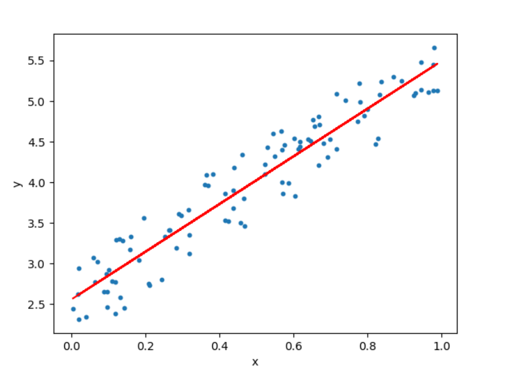

## Linear Regressions

Linear regressions tends to establish a relationship between a dependent variable `Y` and one or more independent variable `X` by finding the best fit of the straight line.

The equation for linear model is $Y = mX + c$, where $m$ is the slope and $c$ is the intercept.

In the above diagram, the blue dots we see are the distribution of `y` with respect to `x`. There is no straight line that runs through all the data points. So, the objective here is to fit the best fit of a straight line that will try to minimize the error between the expected and actual value.

Read more:
- [What is ordinary least square model?](ordinary-least-square-model.md)

> Source: [iNeuronai](https://github.com/iNeuronai/interview-question-data-science-)