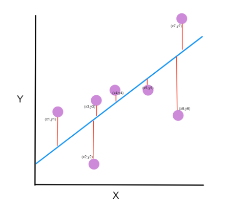

The mean squared error tells you how close a regression line is to a set of points. It does this by taking the distance from the points to the regression line (these distance are the "errors") and squaring them.

Giving an intuition

The line equation in `Y = mX + c`. We want to find `m` (slope) and `c` (intercept) that minimize the squared error.

$$
MSE = \frac{1}{n} \displaystyle\sum\limits_{i=1}^n (y_i - \hat{y_i})^2
$$

Read more: [Linear Regression](linear-regression.md)

> Source: [iNeuronai](https://github.com/iNeuronai/interview-question-data-science-)