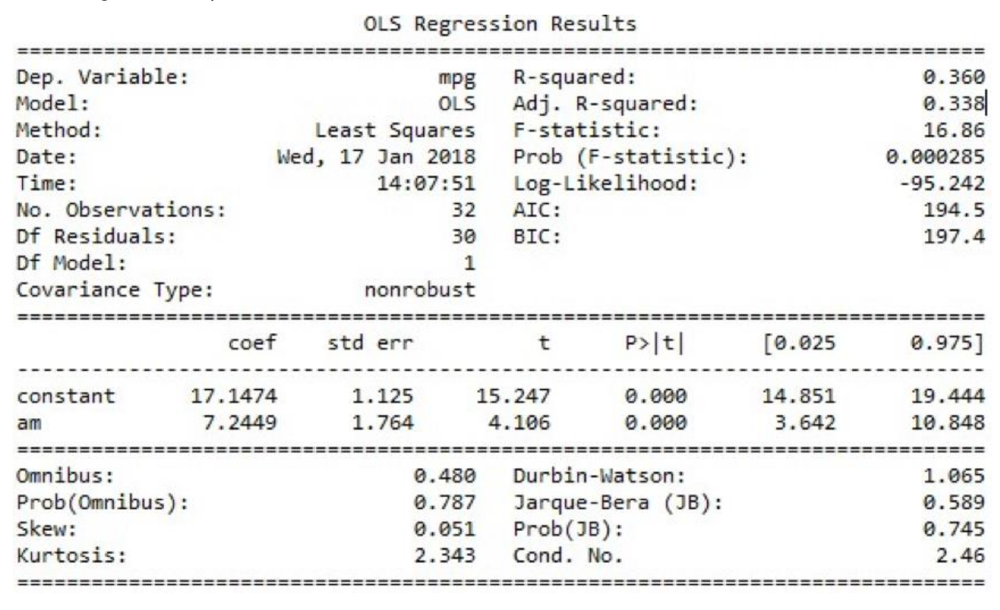

OLS (Ordinary Least Square) is a stats model, which will help us in identifying the more significant features that can has an influence on the output.

OLS model in python is executed as:

```python
lm = smf.ols(formula='Sales ~ am + constant', data=data).fit()
lm.conf_int()
lm.summary()
```

and we got the output as below,



The higher the `t-value` for the feature, the more significant the feature is to the output variable. The `p-value` plays a rule in rejecting the null hypothesis. If the `p-value` is less than `0.05` (95% confidence interval) for a feature, then we can consider the feature to be significant.