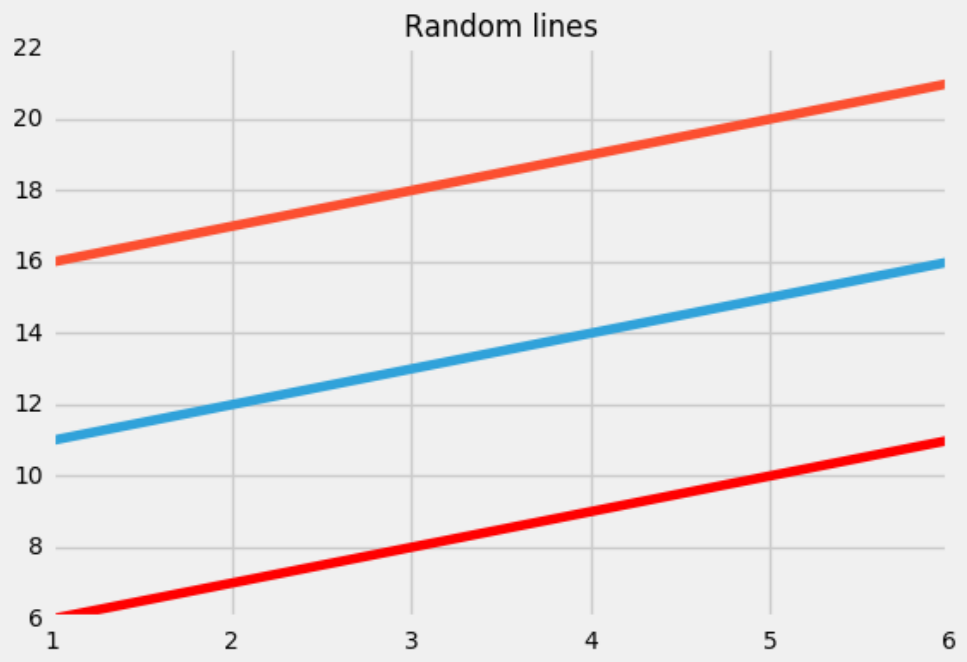
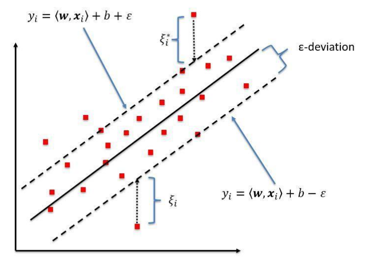

Why SVR (support vector regression)? What is the difference between SVR and a simple regression model?

The answer is, simple linear regression try to minimize the error rate. But in SVR, we try to fit the error within a certain threshold.

Main concept:
- Boundary Line (Red Line)
- Kernel
- Support Vector
- Hyperplane (Blue Line)

Our best fit line is the one where the hyperplane has the maximum number of points. What we are trying to do here is to decide a decision boundary at "e" distance from the original hyperplane such that data points closest to the hyperplane or the support vectors are whithin that boundary line.

> Source: [iNeuronai](https://github.com/iNeuronai/interview-question-data-science-)